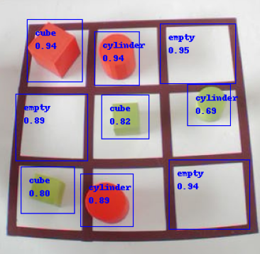

[](https://github.com/tensorflow/tensorflow/releases/tag/v1.15.0)
[](https://www.python.org/downloads/release/python-360/)

# Tensorflow-Object-Detection-with-TF1.15-forTPU

     

This tutorial is a TensorFlow training scripts that perform transfer-learning on a quantization-aware object detection model and then convert it for compatibility with the Edge TPU. Specifically, this tutorial shows you how to retrain a MobileNet V1 SSD model with your own dataset, using TensorFlow 1.15.
For compatibility with the Edge TPU, you must use either quantization-aware training (recommended) or full integer post-training quantization. In Tensorflow 2, there are no quantized model so you must quantify the model after the training. That's why we decided to train a quantized network on tensorflow 1. 
You cannot train a model directly with TensorFlow Lite; instead you must convert your model from a TensorFlow file (such as a .pb file) to a TensorFlow Lite file (a .tflite file), using the TensorFlow Lite converter.
After you train and convert your model to TensorFlow Lite (with quantization), the final step is to compile it with the Edge TPU Compiler.    

     

## HardWare specifications 


## Tutorial 
### 1. Clone the repository :
In a shell download the *tod_tf1* repository on your computer (I recommande you to clone the repository in your home directory $HOME)   
`git clone https://github.com/ta18/tod_tf1`

And create the PYTHON PATH :   
`nano ~/.bashrc`  
Add this line in the end :   
```
export TOD_ROOT="$HOME/tod_tf1"     
export PYTHONPATH=$TOD_ROOT/models:$TOD_ROOT/models/research:$TOD_ROOT/models/research/slim:$PYTHONPATH  
alias tf1="conda activate tf1"
```  
You have to change the TOD_ROOT with your own path (normally it's you home directory $HOME) and source the basrc :    
`source ~/.bashrc`

### 2. Create the virtual environnement :   
You have to create a virtual environnement with python 3.6 :
`conda create -n tf1 python=3.6`  
When the environnement it's create, enter in :    
`conda activate tf1`  or just `tf1` thanks to the alias in .bashrc file
Then, install Tensorflow 1.15 :     
`pip uninstall tensorflow -y`    
`pip install tensorflow-gpu==1.15` 
If you work on a CPU :   
`pip install tensorflow==1.15`    

Your environnement it's ready ! 

### 3. Go on your virtual environnement on a new shell :   
Open a new shell and go here : 
`cd ~/tod_tf1` enter the path of your tod_tf1 folder    

Write this command to enter to your environnement : 
`tf1`   

Open the notebook *Retrain SSD mobilnet for object detection.ipynb* with jupyter notebook :     
`jupyter notebook`   
A web page open, and you have to open the *Retrain SSD mobilnet for object detection.ipynb* notebook.  
For now follow this notebook.   

Training notebook : https://github.com/ta18/tod_tf1/blob/main/Retrain%20SSD%20mobilnet%20for%20object%20detection.ipynb    
Use the training network notebook : https://github.com/ta18/tictactoe2021/blob/main/notebooks/test_formDetection_tf1.ipynb   
